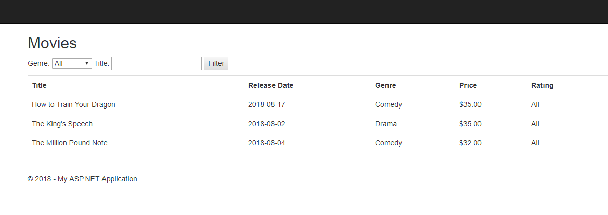
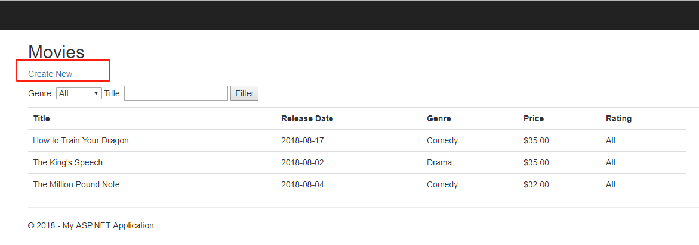
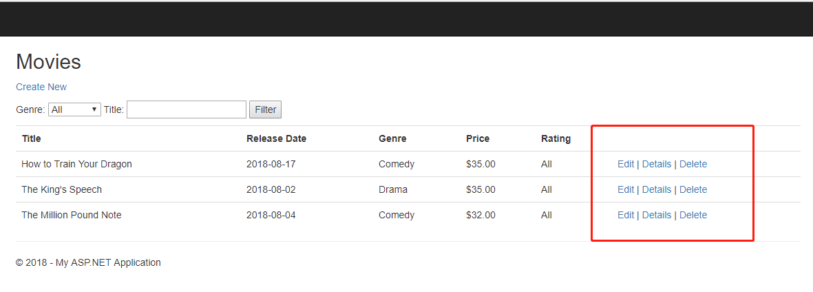

# Basic Asp.Net MVC 
Hi! This project is to quickly get familiar with Asp.Net MVC.The basic point is to get familiar Asp.Net MVC some basic use,the homework is to check your result.

## Concepts you need to know
1. Action Result
2. Razor View
3. Authorization
4. Session
5. Coookie
6. Route
7. Life Cycle

doc：https://www.jianshu.com/p/5f6156cacc76

## Basic Point

    You can search "basic points  " in this project to finish it
### 1. Result
    code is in the BasicASP.NETMvc.Controllers.ActionResultController
    
    TestCase is in the BasicASP.NETMvc.Controllers.Tests.ActionResultControllerTests
    
    Please modify code and pass TestCase
    
    doc: https://www.cnblogs.com/supersnowyao/archive/2018/01/15/8287775.html
### 2.Authorization,Cookie,Session
    
    BasicASP.NETMvc.Controllers.AuthController.Page() will be authorized in Basic point part 
    
    cshtml is in the BasicASP.NETMvc.Views.Auth
    
    code is in the BasicASP.NETMvc.Controllers.RazorViewController 
    
    Please modify .cshtml and .cs files to achieve the desired effect
    Reference doc:
        https://www.cnblogs.com/JoeSnail/p/8250231.html
            https://blog.csdn.net/slowlifes/article/details/79521680
### 3.Routes
    code is in the BasicASP.NETMvc.Controllers.RouteController
    
    Please modify cshtml files to achieve the desired effect
### 4.Life Cycle
    doc:
    https://docs.microsoft.com/en-us/aspnet/mvc/overview/getting-started/lifecycle-of-an-aspnet-mvc-5-application
    https://www.cnblogs.com/xiao-bei/p/5165884.html
    
## Some homework
    First,you should finish the task in the part of Basic Point
    Then you can search "# homework " in this project to finish it
### What you need to do
1. You need to use the property 'MovieDBContext' of MoviesController to help you finish this homework,it can help you do some CRUD action
2. You need to hack the authorization result page redirection, to jump to the homework movie index page
3. You need to read data from local-db for display on the movies site
4. You need to add a button for redirect create movie site
5. You need to finish the create logic in action
6. You need to finish the edit logic in action
7. You need to finish the delete logic in action
8. You need to add the search logic
9. When you finish it ,you will have a simple movie manage system

### How to verify

1. When you finish homework(1,2,3),you can see this page

2. When you finish homework(4,5),you can see this site and create new movie data

3. When you finish homework(6),the index site will be this

4. When you finish homework(7),you can use the search
5. When you have completed the homework, you can perform additions, deletions, and changes.
--- 
### Good Luck!
